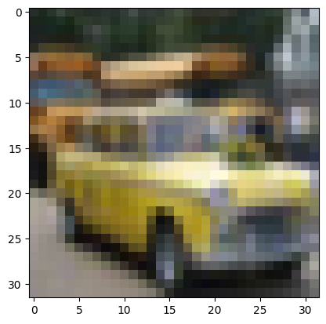

# CIFAR-10 CNN

A simple afternoon project : CNN trained to predict classes of the CIFAR-10 dataset
Trained 15min on Intel i7 CPU, ~80% test accuracy, 0.7M parameters

architecture : **VGG** inspired

featuring : **Dropout** and **BatchNorm**

# results
Works kinda well, to improve it further I would use data augmentation :

pred : automobile with probability : 0.96, correct class : automobile

